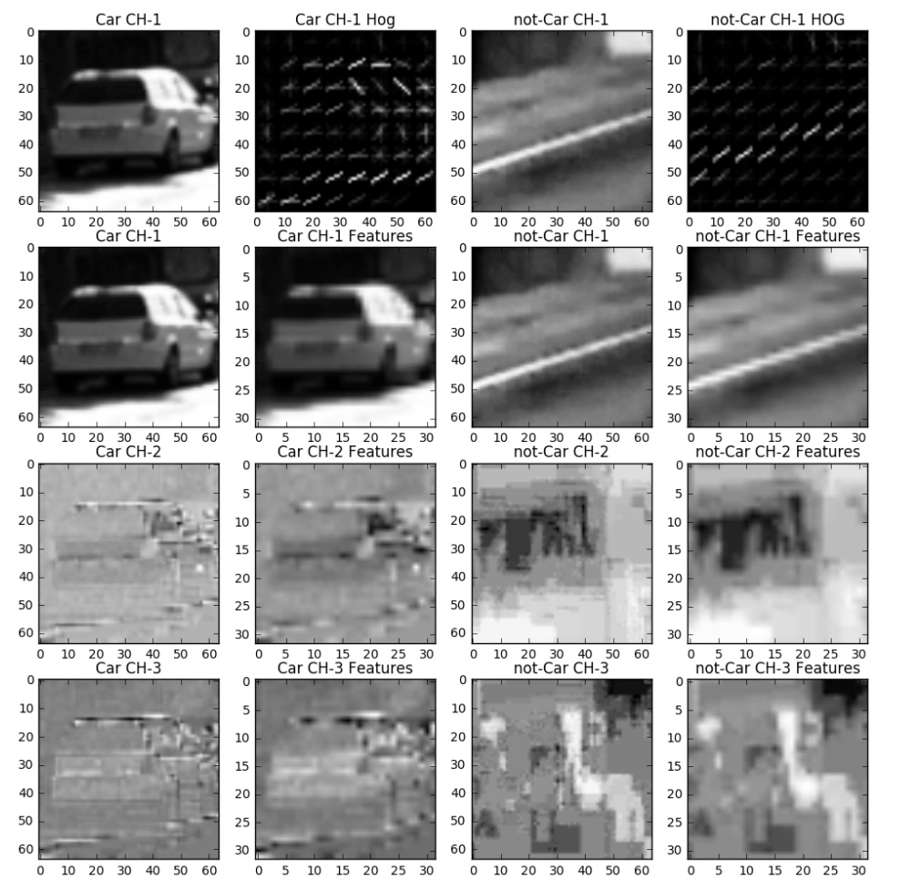
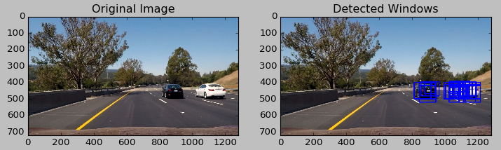
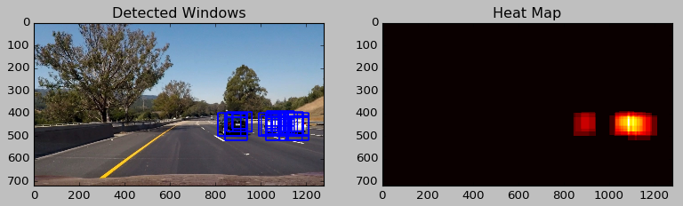
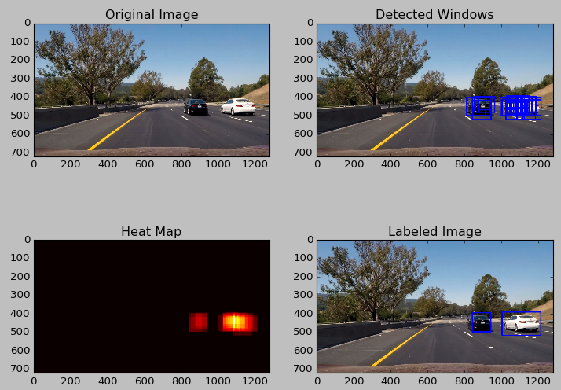

# Udacity-Vehcile-Detection
[](http://www.udacity.com/drive)
  
This project uses computer vision & machin learning to a build software pipeline to identify vehicles in a video.

# Overview
The goals / steps of this project are the following:

* Perform a Histogram of Oriented Gradients (HOG) feature extraction on a labeled training set of images and train a classifier Linear SVM classifier
* Optionally, you can also apply a color transform and append binned color features, as well as histograms of color, to your HOG feature vector. 
* Note: for those first two steps don't forget to normalize your features and randomize a selection for training and testing.
* Implement a sliding-window technique and use your trained classifier to search for vehicles in images.
* Run your pipeline on a video stream (start with the test_video.mp4 and later implement on full project_video.mp4) and create a heat map of recurring detections frame by frame to reject outliers and follow detected vehicles.
* Estimate a bounding box for vehicles detected.

Here I will consider the [rubric points](https://review.udacity.com/#!/rubrics/513/view) individually 
and describe how I addressed each point in my implementation. 

### Feature extraction
Three features are used here in [feature_extract.py](feature_extract.py):
* bin spatial feature with resized 32x32 image
* rgb color histogram feature with bin number of 32
* histogram of oriented gradients (HOG) of all three channels
```python
@use_feature
def bin_spatial(img, size=(32, 32)):
    """Return bin spatial features of the given image."""
    ...

@use_feature
def color_hist(img, nbins=32, bins_range=(0, 256)):
    """Return the RGB features of the given image"""
    ...

@use_feature
def hog_feature(img, feature_vectore=True):
    """Return the HOG features of the given image"""

    # parameters to tune
    orient = 9
    pix_per_cell = 8
    cell_per_block = 2
    ...
```
Tried some combinations like HSV + HOG of grayscale, RGB + HOG of grayscale and only HOG of grayscale.
But the test accuracy is around 95%, at last I use the HOG of all three channels and also the bin spatial
and rgb features:


### Classifier
A Linear SVM is trained in [classifier.py](classifier.py) using `sklearn`:
```python
clf = Pipeline([
    ("scaler", StandardScaler()), # feature is normalized before feeding to classifier
    ("svm_clf", LinearSVC())
])
```
Data comes from a combination of the [GTI vehicle image database](http://www.gti.ssr.upm.es/data/Vehicle_database.html), 
the [KITTI vision benchmark suite](http://www.cvlibs.net/datasets/kitti/), and 
examples extracted from the project video itself. 
  
Using 10% data as validation set, the validation accuracy is 98.7%.

### Sliding Window
Four different window sizes are used to search possible areas in [sliding_window.py](sliding_window.py):
```python
def multi_scale_windows(img):
    """Return dict of size -> a list of window positions"""
    size2windows = {
        64:  slide_window(img, x_left=150, x_right=1150, y_top=380, y_bottom=500, xy_window=(64, 64), xy_overlap=(0.7, 0.8)),
        85:  slide_window(img, y_top=380, y_bottom=500, xy_window=(85, 85), xy_overlap=(0.7, 0.8)),
        100: slide_window(img, y_top=400, y_bottom=600, xy_window=(100, 100), xy_overlap=(0.7, 0.8)),
        200: slide_window(img, y_top=400, y_bottom=650, xy_window=(200, 200), xy_overlap=(0.7, 0.8))
    }
    return size2windows
```
Overlap of windows is set to 0.8 along y-axis and 0.7 along x-axis. The cropped windows will be fed into
classifier to predict whether there is a car:  


### Heat Map
Heat map is used to extract vehicle position from multiple windows in [heat_map.py](heat_map.py).
Each window will add 1 value to its area pixels, so the overlapped area will have a higher value.
Then a threshold will be applied to reject outliners or false positives:


Using heat map, the pipeline becomes more tolerant of false negatives while false positives will
add noise. To exploit this fact, instead of using `clf.predict` to predict, I threshold the 
decision function by 0.4 here. This will help to reduce some false positives at the cost of having 
more false negatives which is ok.
```python
classifier.decision_function(feature) > 0.4
```
  
Another thing to reject the outliners and some of the false positives is checking the size of 
the area. If it's too small, it will be omitted.

### Image Pipeline
Run the [image_pipeline.py](image_pipeline.py), it will draw the final detection on the image:
```bash
> python image_pipeline.py -h
usage: Display processed image. [-h] [-f F] [-d D] [-o O]

optional arguments:
  -h, --help  show this help message and exit
  -f F        path to test image
  -d D        show result of each stage of pipeline
  -o O        path to output image
> python image_pipeline.py -f test_images/test6.jpg -d 1
```


### Video Pipeline
Video pipeline is basically same as image pipeline except that it will
apply threshold on the sum of heatmaps from previous 5 frames.Run the
[video_pipeline.py](video_pipeline.py):
```bash
> python video_pipeline.py -h
usage: Process video. [-h] [-f F] [-o O]

optional arguments:
  -h, --help  show this help message and exit
  -f F        path to video
  -o O        path to output video
```
[link to video](test_videos/project_video.mp4)

### Discussion
Two things to try and improve later:
* Try different feature combinations and maybe feature vector length could be reduced to improve speed.
* Using YOLO or Fast RCNN instead of sliding window since it will do some repetitive computation and lower the speed of pipeline.

